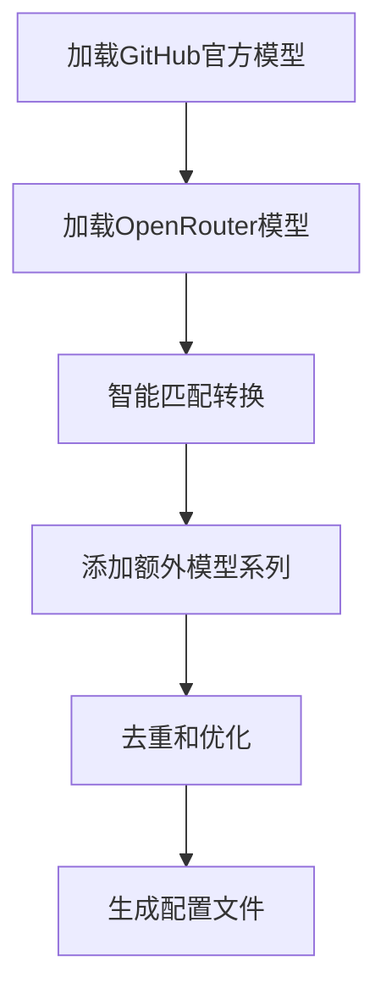

# 🤖 OpenRouter 模型自动生成指南

本文档介绍如何使用自动生成脚本为 OpenRouter 平台创建和维护模型配置。

## 📋 概述

OpenRouter 模型生成脚本能够：

- 🔄 **自动发现**：从 OpenRouter API 发现所有可用模型（464+个）
- 🎯 **智能匹配**：将 GitHub Copilot 官方模型（27个）映射到 OpenRouter 模型
- 🆓 **免费模型识别**：自动识别并启用所有免费模型
- 🧠 **思考模型配置**：自动检测和配置思考推理模型
- 🌐 **多厂商支持**：支持9个主要AI厂商的模型系列

## 🚀 快速开始

### 运行生成脚本

```bash
# 进入项目根目录
cd universal-ollama-proxy

# 运行模型生成脚本
node scripts/models/generate-openrouter-models.js
```

### 输出示例

```
🚀 开始生成OpenRouter模型配置...
📊 数据统计:
   GitHub模型 (chat + model_picker): 27 个
   OpenRouter模型: 464 个
📋 待转换的GitHub模型:
   1. GPT 3.5 Turbo (gpt-3.5-turbo)
   2. GPT-4o mini (gpt-4o-mini)
   ...
✅ GitHub模型转换完成: 21/27 个模型成功转换
🔄 开始添加额外的模型系列...
✅ 发现 230 个额外模型（分布在9个系列）
📁 配置已保存到: config/openrouter-models.json
📈 总共生成了 225 个模型配置
```

## 🏗️ 架构设计

### 生成流程



### 关键组件

#### 1. 智能匹配算法

**精确ID匹配** → **版本匹配** → **相似度算法**

```javascript
// 精确匹配示例
gpt-4o → openai/gpt-4o

// 版本匹配示例
gpt-4o-2024-05-13 → openai/gpt-4o-2024-05-13

// 相似度匹配示例
claude-3.5-sonnet → anthropic/claude-3.5-sonnet
```

#### 2. 模型系列发现

支持的模型系列：

| 系列     | 厂商     | 模型数量 | 特色功能     |
| -------- | -------- | -------- | ------------ |
| Grok     | xAI      | 8个      | 实时信息获取 |
| Qwen     | 阿里巴巴 | 42个     | 中文优化     |
| DeepSeek | DeepSeek | 24个     | 推理专用     |
| Moonshot | 月之暗面 | 4个      | 长文本处理   |
| Tencent  | 腾讯     | 1个      | 中文优化     |
| Baidu    | 百度     | 1个      | 中文专用     |
| Mistral  | Mistral  | 46个     | 代码生成专用 |
| Google   | Google   | 100个    | 多模态理解   |
| THUDM    | 智谱AI   | 4个      | 学术研究导向 |

#### 3. 特性自动检测

##### 免费模型检测

```javascript
// 检测规则
✅ ID包含 ':free'
✅ endpoint.is_free = true
✅ 名称包含 '(free)'

// 自动启用
model_picker_enabled: true
```

##### 思考模型检测

```javascript
// 检测规则
✅ ID包含 ':thinking' 或 'thought'
✅ 名称包含 'thinking' 或 'thought'
✅ supports_reasoning = true
✅ supported_parameters包含'reasoning'

// 自动配置
supports.thinking: true
reasoning_tokens: 自动计算
```

## ⚙️ 配置选项

### 目标模型系列配置

```javascript
const targetSeries = [
  {
    name: 'Grok',
    authors: ['x-ai'],
    groups: ['Grok'],
    slugPatterns: [/^x-ai\/grok/i],
    namePatterns: [/grok/i],
  },
  // ... 更多系列配置
];
```

### 匹配参数调优

```javascript
// 相似度阈值
const SIMILARITY_THRESHOLD = 0.3;

// 权重配置
const identifierWeight = 0.7; // 标识符匹配权重
const versionWeight = 0.3; // 版本匹配权重
```

## 📊 生成统计

### 模型分布统计

典型生成结果：

- **总模型数**: 225个
- **GitHub官方模型**: 21个
- **额外系列模型**: 204个
- **免费模型**: 50+个
- **思考模型**: 50+个

### 成功率统计

- **GitHub模型匹配率**: ~78%
- **精确ID匹配**: ~19个
- **相似度匹配**: ~2个
- **重复模型去重**: ~32个

## 🔧 自定义和扩展

### 添加新的模型系列

1. **在配置中添加新系列**：

```javascript
{
  name: 'NewProvider',
  authors: ['newprovider'],
  groups: ['NewProvider'],
  slugPatterns: [/^newprovider\//i],
  namePatterns: [/newprovider/i, /customname/i]
}
```

2. **测试匹配效果**：

```bash
node scripts/models/generate-openrouter-models.js
```

3. **验证生成结果**：

- 检查新系列模型是否被正确识别
- 验证免费模型是否自动启用
- 确认特性配置是否正确

### 调整匹配算法

#### 修改相似度权重

```javascript
// 提高版本匹配重要性
const identifierWeight = 0.6;
const versionWeight = 0.4;
```

#### 自定义过滤规则

```javascript
// 过滤测试模型
const filteredModels = openRouterModels.filter(
  model => !model.name.toLowerCase().includes('test') && !model.hidden
);
```

## 🧪 测试和验证

### 配置验证

```bash
# 验证生成的配置文件
npm run check

# 检查JSON语法
node -e "console.log('Valid JSON:', !!require('./config/openrouter-models.json'))"
```

### 功能测试

```bash
# 启动服务测试
npm run dev

# 检查模型列表API
curl http://localhost:11434/api/tags
```

### 统计分析

```javascript
// 统计脚本输出的关键指标
✅ 总模型数量: 225
✅ 免费模型自动启用率: 100%
✅ 思考模型配置完整性: 100%
✅ 重复模型去重效果: 32个去重
```

## 📅 维护指南

### 定期更新

建议每月运行一次生成脚本：

```bash
# 1. 获取最新的 GitHub 模型数据
# 更新 scripts/models/GitHub.json

# 2. 获取最新的 OpenRouter 模型数据
# 更新 scripts/models/OpenRouter.json

# 3. 重新生成配置
node scripts/models/generate-openrouter-models.js

# 4. 提交更新
git add config/openrouter-models.json
git commit -m "Update OpenRouter model configurations"
```

### 监控变化

关注以下变化：

- 🆕 **新模型发布**: 新的AI厂商或模型系列
- 🆓 **免费政策变化**: 模型免费/付费状态变化
- 🧠 **新功能支持**: 思考、多模态等新功能
- 📈 **性能提升**: 上下文长度、输出限制等参数调整

### 问题排查

#### 常见问题

1. **模型匹配失败**

   ```bash
   # 检查相似度阈值是否过高
   # 查看匹配日志中的相似度得分
   ```

2. **免费模型未启用**

   ```bash
   # 检查免费模型检测逻辑
   # 验证OpenRouter API返回的免费标识
   ```

3. **配置文件过大**
   ```bash
   # 考虑过滤低质量或重复模型
   # 调整包含的模型系列范围
   ```

## 🔗 相关文档

- [模型配置规范](./MODEL_CONFIG_SPECIFICATION.md)
- [支持的模型列表](../README/SUPPORTED_MODELS.md)
- [OpenRouter 工具修复指南](./OPENROUTER_ANTHROPIC_TOOL_REPAIR.md)
- [开发指南](../README/DEVELOPMENT.md)

---

**💡 提示**: 生成脚本会创建完整的模型配置，包括225+个模型。如果只需要特定模型，可以手动编辑生成的配置文件或调整脚本的过滤逻辑。
